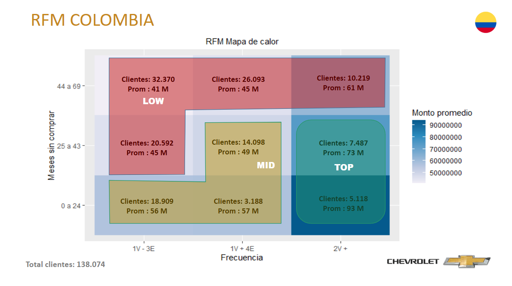
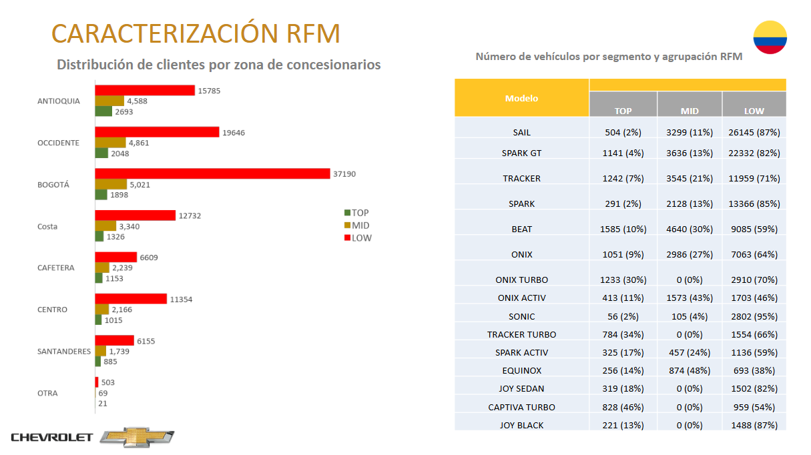
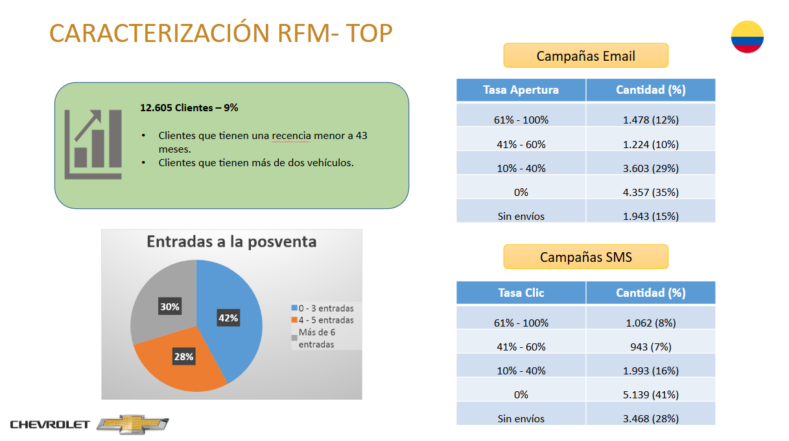
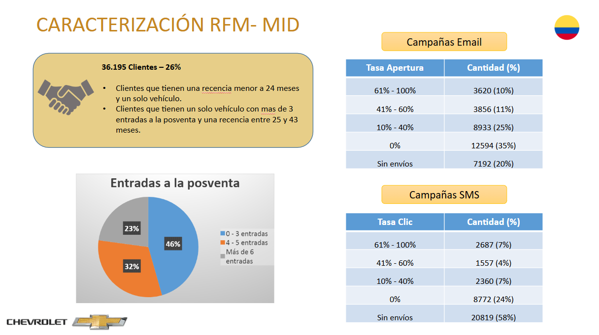

# 📊 Análisis RFM y Segmentación de Clientes - Chevrolet Colombia

Este proyecto fue desarrollado para **Chevrolet Colombia** con el objetivo de caracterizar a sus clientes mediante análisis de recencia, frecuencia y monto (RFM), optimizando la segmentación para campañas de retención y posventa. A partir de bases de datos transaccionales, se realizaron cruces, transformaciones y visualizaciones que permitieron identificar patrones de comportamiento por zonas, modelos de vehículos y tipo de cliente.

---

## 🎯 Objetivo del Proyecto

Analizar el comportamiento de los clientes de Chevrolet con base en su historial de compras y posventa, mediante un modelo de **segmentación RFM**. Se buscó:

- Identificar grupos de clientes según su valor para la compañía.
- Establecer zonas y modelos con mayor retención.
- Relacionar comportamiento con efectividad de campañas de email y SMS.
- Recomendar estrategias de fidelización por segmento.

---

## 🧠 ¿Qué es el Modelo RFM?

El modelo **RFM (Recency, Frequency, Monetary)** es una técnica de segmentación de clientes que clasifica a los usuarios según:

- **Recency (R)**: Hace cuántos meses realizó la última compra o visita el cliente.
- **Frequency (F)**: Número de veces que ha comprado o ha realizado visitas en un periodo determinado.
- **Monetary (M)**: Cuánto ha gastado el cliente en total o en promedio.

Este enfoque permite identificar distintos tipos de clientes según su comportamiento:

- **TOP**: Clientes frecuentes, con compras recientes y alto valor monetario. Representan el segmento más rentable y con mayor fidelidad.
- **MID**: Clientes intermedios, con frecuencia moderada o valor medio. Pueden ser fidelizados con estrategias adecuadas.
- **LOW**: Clientes inactivos o de bajo valor, que requieren estrategias de reactivación o se consideran de baja prioridad.

El análisis RFM es ampliamente usado en marketing y CRM para personalizar campañas, optimizar recursos y mejorar la rentabilidad de las acciones comerciales.

### 🧪 Metodología aplicada

1. **Cálculo de variables**  
   - *Recency*: Número de meses desde la última transacción o entrada a posventa.  
   - *Frequency*: Total de vehículos comprados y visitas a taller por cliente.  
   - *Monetary*: Suma del valor de todas las compras realizadas (ajustado a precios 2021).

2. **Estandarización**  
   Se construyeron escalas de percentiles para cada variable, permitiendo comparar a los clientes entre sí según su comportamiento.

3. **Segmentación**  
   A partir de los puntajes R, F y M, se agruparon los clientes en tres segmentos principales:
   - **TOP**: Alta frecuencia, actividad reciente y mayor gasto.
   - **MID**: Nivel intermedio en al menos una de las dimensiones.
   - **LOW**: Baja frecuencia, inactividad reciente y menor gasto.

Esta metodología permite una toma de decisiones más precisa en marketing, fidelización y reactivación de clientes, al priorizar recursos según el valor real de cada grupo.

---

## 🛠 Tecnologías utilizadas

- **SQL Server**: Extracción y transformación de datos transaccionales y demográficos. [`Script sql`](scripts/ConsultaClientes.sql)
- **R**: Desarrollo de mapas de calor, visualizaciones y validaciones estadísticas. [`Script R`](scripts/MapadeCalorRFM_col.R)
---

## 📁 Estructura del repositorio
```
/proyectos/Modelo_RFM_Chevrolet_Colombia/
│
├── scripts/
│ ├── MapadeCalorRFM_col.R
│ └── ConsultaClientes.sql
│
├── images/
│ ├── 01_RFM_Mapa_de_Calor.png
│ ├── 02_Caracterizacion_RFM_TOP.png
│ ├── 03_Caracterizacion_RFM_MID.png
│ ├── 04_Caracterizacion_RFM_LOW.png
│ └── 05_Caracterizacion_RFM_Concesionarios.png
│
├── README.md
```

---

## 📌 Resultados Destacados

### 1. Mapa de Calor RFM  
  Segmentación en clientes **TOP**, **MID** y **LOW** en función de sus compras y frecuencia.
    
  
---

### 2. Caracterización RFM por zona y modelo de vehículo  
  Distribución regional y por modelo según grupos RFM.
    

---

### 3. Perfilamiento de Clientes

- **Clientes TOP**  
  

- **Clientes MID**  
  

- **Clientes LOW**  
  

---

## 📝 Conclusiones Estratégicas

- El **65%** de los clientes se encuentran en el grupo **LOW**, con baja frecuencia de compra y poco engagement.
- Los clientes **TOP** (9%) son altamente fieles y presentan mayor apertura a campañas.
- Se evidenció una correlación positiva entre frecuencia de entrada a posventa y respuesta en campañas.
- Se recomiendan acciones diferenciadas para cada grupo, especialmente para reactivar clientes del segmento MID y retener a los TOP.

---

## ⚠️ Nota Legal
*Los datos y visualizaciones presentados en este proyecto están destinados únicamente a fines académicos y demostrativos. Toda la información confidencial ha sido procesada para cumplir con estándares de privacidad y ética profesional.*

---

## 👤 Autor
**Sebastián González**  
Data Scientist 

> Proyecto desarrollado como parte del equipo de Data de INXAIT.


